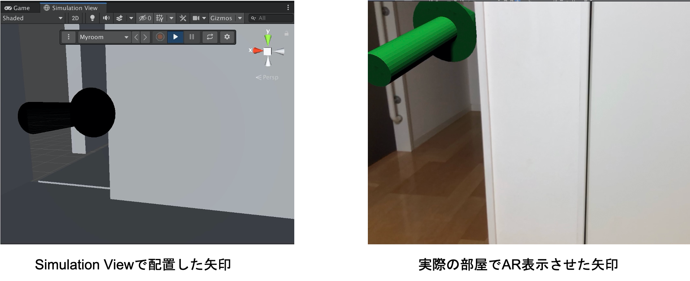

# UnityMARS_ImageMarkerTest

# 概要
Unity MARS 1.1.1を使って、マーカを認識したら矢印を表示するサンプルプロジェクトです。  
このリポジトリを使った記事は近日公開予定です。

# 動作確認環境  

Unity 2019.4.12f1 LTS  
MARS 1.1.1  
MacOSX 10.15.6  
iOS 13.7 (iPhone8)  

# 環境構築の手順

1. Unity2019.4.12f1で新しくプロジェクトを作成する  
2. MARSの購入手続きで取得した「MARS_Installer.unitypackage」をインポートする  
3..GitHubよりImageMarkerTest.unitypackageをダウンロードしてインポートする  

4. iOS/Androidに合わせて、Package ManagerでARKit/ARCore XR Pluginをインストールする  
5. MyProject/sim_testシーンを開く   
6. Build Settingで設定してiOS/Android向けにデプロイする  

Simulation ViewにMyroomが追加されていない場合、sim_testを開いてから再度Simulation Viewを開いてください。

